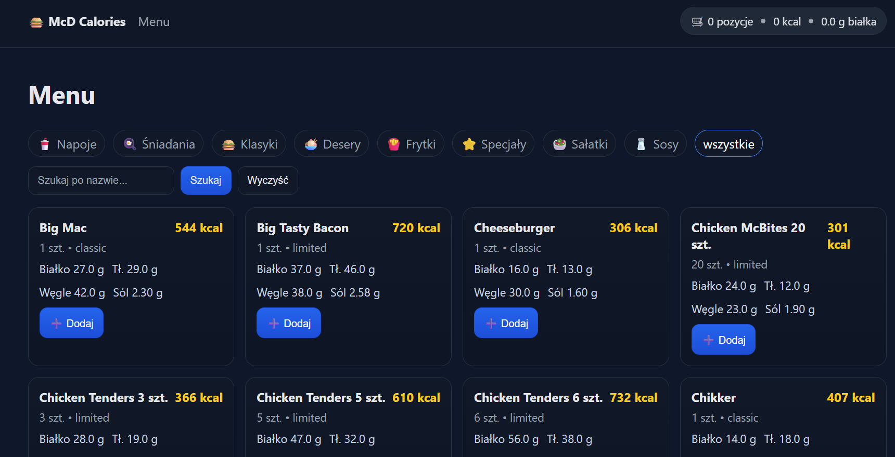
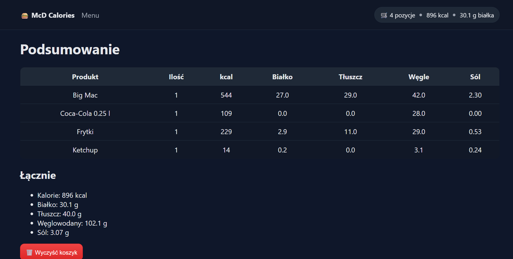

# 🍔 McD Calories App

A simple **Flask web application** that lets users browse McDonald’s menu, add products to a cart, and automatically calculate total calories, protein, fat, carbs, and salt.

---

## ✨ Features
- 🔍 Browse products by category and search by name  
- 🛒 Add and remove items from your cart  
- 📊 View detailed nutrition summary (kcal, protein, fat, carbs, salt)  
- 💾 Data stored in a local SQLite database  
- 🎨 Clean, modern dark theme with responsive layout  

---

## 🖼️ Screenshots

### 🧾 Menu View
Browse all products, filter by category or search by name.

### 🛍️ Cart Summary
See nutrition totals for selected products.

### 🧠 Tech Stack

Python 3.11+

Flask

SQLite

HTML + CSS

### 💡 Author

### drgn77
💻 Created as a personal learning project to practice Python, Flask, and web design.

Used gpt for documentation.